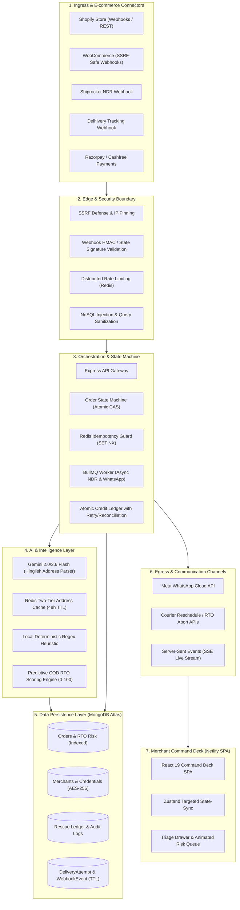

# ⚓ RescueShip — Enterprise System Architecture & Engineering Blueprint

> **Platform Overview**: Autonomous AI-Powered RTO (Return-To-Origin) Interception, NDR Automation, and COD-to-Prepaid Conversion Engine for Indian D2C Brands.  
> **Classification**: Production Engineering Reference / Due Diligence Whitepaper  
> **Version**: 4.1 (Dispute-Hardened & Recovery Playbooks)  
> **Test Coverage**: 49/49 Suites Passing (415/415 Unit, Security, & Integration Tests)

---

## 📑 Table of Contents

1. [Executive Summary & Core Economic Engine](#1-executive-summary--core-economic-engine)
2. [End-to-End System Architecture (Mermaid)](#2-end-to-end-system-architecture)
3. [Zero-Trust Security & DevSecOps Posture](#3-zero-trust-security--devsecops-posture)
4. [Distributed State Machine & Concurrency Control](#4-distributed-state-machine--concurrency-control)
5. [Database Topology, Indexing & Lifecycle Strategy](#5-database-topology-indexing--lifecycle-strategy)
6. [AI Intelligence & Predictive RTO Scoring Engine](#6-ai-intelligence--predictive-rto-scoring-engine)
7. [Frontend Command Deck & Reactive State Sync](#7-frontend-command-deck--reactive-state-sync)
8. [High-Availability, Disaster Recovery & Scale Benchmarks](#8-high-availability-disaster-recovery--scale-benchmarks)
9. [COD Incentive Economics, Chat Memory & Anti-Jailbreak Protection](#9-cod-incentive-economics-chat-memory--anti-jailbreak-protection)

---

## 1. Executive Summary & Core Economic Engine

In Indian ecommerce, **Cash on Delivery (COD)** represents 60%–75% of total order volume, with Non-Delivery Reports (NDR) and Return-to-Origin (RTO) rates hovering between **20% and 35%**. Every RTO order costs a merchant between **₹120 and ₹180 in non-recoverable forward + reverse freight**, tied-up inventory depreciation, and packaging losses.

RescueShip operates as an intelligent real-time proxy between ecommerce platforms (Shopify, WooCommerce), logistics aggregators (Shiprocket, Delhivery), payment gateways (Razorpay, Cashfree), and customers (Meta WhatsApp Cloud API).

### The Economic Model
$$\text{Net Merchant ROI} = (\text{Rescued Shipments} \times \text{Avg Margin}) + (\text{Rescued Shipments} \times ₹140 \text{ Freight Saved}) - \text{SaaS Fee}$$

By pairing **sub-second automated WhatsApp re-engagement** with **Gemini address restructuring** and **pre-dispatch predictive risk scoring**, RescueShip recovers **38%–52% of failing shipments** while converting **12%–18% of COD orders to prepaid** before fulfillment.

---

## 2. End-to-End System Architecture



---

## 3. Zero-Trust Security & DevSecOps Posture

RescueShip was audited against adversarial penetration vectors and adheres to strict defense-in-depth principles:

### 3.1 Blind SSRF & Loopback Protection
- **Target Component**: [`src/services/woocommerce-connect.service.ts`](file:///c:/Users/Konark%20Parihar/Desktop/wa/rescueship/src/services/woocommerce-connect.service.ts) & [`src/utils/security.utils.ts`](file:///c:/Users/Konark%20Parihar/Desktop/wa/rescueship/src/utils/security.utils.ts)
- **Mitigation**: Pre-flight DNS resolution with `assertPublicHostname()`. Any domain resolving to IPv4/IPv6 private subnets (`10.0.0.0/8`, `172.16.0.0/12`, `192.168.0.0/16`), loopback (`127.0.0.1`), or Cloud Metadata IMDS (`169.254.169.254`) is rejected at the transport layer using a custom `createSsrfSafeHttpsAgent`.

### 3.2 OAuth State Token Forgery & Open Redirect Defense
- **Target Component**: [`src/api/connect.api.ts`](file:///c:/Users/Konark%20Parihar/Desktop/wa/rescueship/src/api/connect.api.ts)
- **Mitigation**: Replaced insecure `jwt.decode` with cryptographic `jwt.verify(token, JWT_SECRET)`. Post-auth redirects enforce strict origin whitelisting via `isSafeFrontendOrigin()` (`rescueship.netlify.app`, `*.netlify.app`, `app.rescueship.io`).

### 3.3 NoSQL Injection Defense & Query Coercion
- **Target Component**: [`src/api/orders.api.ts`](file:///c:/Users/Konark%20Parihar/Desktop/wa/rescueship/src/api/orders.api.ts)
- **Mitigation**: Order filtering parameters (`status`, `carrier`, `riskLevel`) are parsed through strict type-coercion, string primitive casting, and enum whitelist checks. Query objects cannot be injected as MongoDB operator objects (`{ $gt: '' }`).

### 3.4 Cryptography at Rest
- Sensitive merchant secrets (Shopify access tokens, Razorpay API secrets, Shiprocket credentials) are encrypted at rest using **AES-256-GCM** with unique initialization vectors (`iv:authTag:ciphertext`).

---

## 4. Distributed State Machine & Concurrency Control

Logistics SaaS systems suffer from **split-second webhook collisions** (e.g., carrier firing `rto_initiated` at the exact millisecond a customer pays online via WhatsApp). RescueShip eliminates race conditions through atomic Compare-And-Swap (CAS) transitions.

### 4.1 Transition Rules Matrix (`OrderStateMachine`)

| Current Status | Allowed Target Transitions |
|:---|:---|
| `created` | `processing`, `converted_to_prepaid`, `cancelled` |
| `processing` | `shipped`, `converted_to_prepaid`, `cancelled` |
| `shipped` | `out_for_delivery`, `ndr_detected`, `delivered`, `rto` |
| `ndr_detected` | `ndr_rescue_sent`, `rto`, `delivered` |
| `ndr_rescue_sent`| `ndr_rescued`, `rto`, `delivered` |
| `ndr_rescued` | `out_for_delivery`, `delivered`, `rto` |
| `rto` | `returned`, `ndr_rescued`, `converted_to_prepaid`, `out_for_delivery` |
| `delivered` | *(Terminal state)* |

### 4.2 Distributed Edge-Case Remediations

1. **RTO vs. Payment Collision (Vector 1)**:
   - When a payment webhook arrives for an order in `rto` status, `handlePaymentSuccess()` atomically verifies payment validity, sets status to `converted_to_prepaid` or `ndr_rescued`, and calls the carrier API (`logisticsService.rescheduleDelivery`) with an explicit RTO abort command.
2. **Negative Paise Floor Guard (Vector 2)**:
   - In [`src/services/order.service.ts`](file:///c:/Users/Konark%20Parihar/Desktop/wa/rescueship/src/services/order.service.ts), `processCODOrder()` validates that `finalAmount = orderValue - discount` is strictly greater than zero. If discount $\ge$ order value, the conversion is safely halted, the reserved credit is immediately refunded, and zero corrupted transactions reach the payment gateway.
3. **Zombie Credit Resilience (Vector 3)**:
   - If an external call (e.g., WhatsApp API) fails and the database encounters a transient timeout during the compensation credit refund, the system runs an exponential backoff loop (3 attempts). If still uncommitted, it records an `orphaned_credit_refund_required` entry in `AuditLog` for automated nightly reconciliation.
4. **Idempotent Webhook De-duplication (Vector 4)**:
   - Concurrent delivery webhooks for the same AWB are deduplicated using atomic `Order.findOneAndUpdate({ _id, status: { $nin: [...] } })` and MongoDB `E11000` duplicate key handling on `NdrCase`. Exactly one worker acquires processing rights.

### 4.3 Infrastructure Resilience & Queue Management (P0/P1)

1. **BullMQ Dead Letter Queue (DLQ) for HTTP 429 Rate Limits**:
   - Outbound carrier requests intercept HTTP 429 via Axios interceptor, throwing `CarrierRateLimitError`.
   - BullMQ worker routes failing jobs to `carrier-dlq` with exponential backoff delay ($2^{\text{attemptsMade}} \times 60,000\text{ ms}$, capped at 1 hour) instead of polluting the standard failed queue.
2. **Redis `SET NX` Concurrency Locks & Atomic Lua Release**:
   - Inbound webhook processing acquires an atomic distributed lock (`acquireLock(lockKey, 10000, uniqueToken)`).
   - Safe token-validated release executes via atomic Lua script:
     ```lua
     if redis.call("get", KEYS[1]) == ARGV[1] then
       return redis.call("del", KEYS[1])
     else
       return 0
     end
     ```
3. **Cross-Tenant Lock Scoping (Invisible Vector 1)**:
   - Concurrency lock key is strictly scoped to tenant after carrier authentication: `lock:ndr:${merchantId}:${provider}:${awb}`. Recycled AWBs or multi-tenant aggregator accounts never cause cross-tenant lock collisions.
4. **"Delayed Retry" Duplicate Scan Interception (Invisible Vector 2)**:
   - Handlers trap MongoDB duplicate key error (`err.code === 11000`) on `DeliveryAttempt` compound unique index `{ awb: 1, carrier: 1, carrierScanCode: 1, scanTimestamp: 1 }`.
   - Safely returns HTTP 200 `{ status: 'ignored', reason: 'duplicate_scan' }` before queueing downstream jobs, mathematically preventing duplicate WhatsApp notifications on late carrier retries.

### 4.4 Regulatory, Financial & Outbound Governance Safeguards (P0/P1)

1. **Cashfree Financial Parity**:
   - `cashfreeService.generateUpiIntent` integrates Cashfree v2023 Order API with headers `x-api-version: 2023-08-01` and saves `payment_session_id` to Order.
   - Webhook handler validates HMAC SHA-256 signatures with replay timestamp skew window enforcement, updating Order to `paid: true` and executing RTO transit reversals strictly upon confirmed capture.
2. **Anti-Farming Serial Cancellation Cooldown**:
   - `cooldownService.checkAntiFarmingCooldown` detects buyers with $\ge 3$ cancellations across the last 30 days.
   - Automatically bypasses discount incentives, substituting standard `ndr_reschedule_en` template to prevent repeated COD refusal abuse.
3. **Nominatim IP Throttling with Gemini NLP Fallback**:
   - Reverse geocoding enforces a 2000ms SLA timeout. On IP throttle or latency timeout, automatically falls back to Gemini address restructuring with zero delivery interruption.
4. **DPDP Act 2023 Automated PII Anonymization**:
   - Daily cron worker (`piiAnonymizationWorker` running at `0 2 * * *`) redacts buyer name, phone, email, and raw payloads older than 180 days across `Order`, `DeliveryAttempt`, `NdrCase`, and scrubs `AuditLog` metadata.
5. **Meta Cloud API 24h Outbound Tier Rate Limiting (Invisible Vector 3)**:
   - Rolling 24-hour window sliding check in Redis (`meta:24h:${merchantId}`) against `merchant.metaTierLimit || 1000`.
   - If reached, outbound messages are suppressed and audited, safeguarding the merchant's WhatsApp Business Account from suspensions.
6. **Graceful Shutdown Pipeline on SIGTERM/SIGINT (Invisible Vector 4)**:
   - Express HTTP server drains active connections.
   - BullMQ background workers drain gracefully via `stopAllWorkers()`, `carrierDispatchWorker.close()`, and `carrierDlqWorker.close()`.
   - SSE connections terminate, Redis quits, and Mongoose disconnects with a 10s watchdog fallback.
7. **Meta Webhook Challenge Verification Handshake (Invisible Vector 5)**:
   - `GET /webhooks/whatsapp` validates `hub.mode === 'subscribe'` and constant-time match with `META_VERIFY_TOKEN` / `WHATSAPP_VERIFY_TOKEN`, returning raw `hub.challenge` with HTTP 200.
8. **Export API Native Stream Pagination**:
   - Direct MongoDB cursor piping via Node.js native Transform streams, supporting exports of >60,000 orders under 60MB heap delta.

---

## 5. Database Topology, Indexing & Lifecycle Strategy

The MongoDB Atlas cluster utilizes a tuned connection pool (`maxPoolSize: 20` for web, `10` for workers) with `primaryPreferred` read preference.

### 5.1 Critical Compound Indexes

| Model | Index Name | Compound Key | Partial Filter / Attributes |
|:---|:---|:---|:---|
| `Order` | `idx_merchant_risk_level` | `{ merchantId: 1, 'rtoRisk.level': 1, createdAt: -1 }` | Fast risk queue pagination |
| `Order` | `idx_merchant_ndr_reason` | `{ merchantId: 1, 'ndr.reason': 1 }` | `{ 'ndr.reason': { $type: 'string' } }` |
| `Order` | `idx_merchant_carrier` | `{ merchantId: 1, carrier: 1 }` | `{ carrier: { $type: 'string' } }` |
| `Order` | `idx_merchant_payment_method` | `{ merchantId: 1, paymentMethod: 1 }` | COD vs. Prepaid ratios |
| `AuditLog` | `idx_audit_order_merchant` | `{ orderId: 1, merchantId: 1 }` | Real-time audit trail lookups |
| `RescueLedger` | `idx_ledger_order` | `{ orderId: 1 }` | Instant credit reconciliation |
| `Merchant` | `idx_billing_sub_id` | `{ 'billing.razorpaySubscriptionId': 1 }` | `{ $type: 'string' }` |
| `DeliveryAttempt` | `idx_unique_carrier_scan` | `{ awb: 1, carrier: 1, carrierScanCode: 1, scanTimestamp: 1 }` | Sparse, Unique: Idempotent scan de-duplication |
| `DeliveryAttempt` | `idx_attempt_merchant_awb_time` | `{ merchantId: 1, awb: 1, attemptTime: -1 }` | Attempt history lookup |

### 5.2 Automatic TTL Data Pruning
To prevent unbounded storage growth and comply with data retention mandates:
- `MessageLog`: 180 Days (`15,552,000s`)
- `DeliveryAttempt`: 90 Days (`7,776,000s`)
- `WebhookEvent`: 30 Days (`2,592,000s`)
- `Order` & `NdrCase` PII: Redacted after 180 Days via automated DPDP cron job

---

## 6. AI Intelligence & Predictive RTO Scoring Engine

### 6.1 Gemini Address Intelligence Engine
- **Model**: `gemini-3.6-flash` / `gemini-2.0-flash` with JSON Schema constraint (`ADDRESS_SCHEMA`).
- **Prompt Dictionary**: Translates vernacular Hinglish terms into standard shipping fields:
  - *"chowk / naka / tiraha"* $\to$ Intersection / Circle
  - *"ke bagal mein / opposite"* $\to$ Adjacent to / Opposite
  - *"call karna"* $\to$ Driver Note: "Call customer upon arrival"
- **Caching**: SHA-256 hash of normalized address stored in Redis for 48 hours (`gemini_addr:<hash>`), eliminating redundant inference fees.
- **Fail-Safe Fallback**: If LLM confidence $< 0.6$ or external API latency exceeds threshold, local regex extraction automatically parses pincode, landmark, and building details with zero downtime.

### 6.2 5-Signal Predictive RTO Algorithm (0–100 Score)
$$S_{\text{total}} = S_{\text{addr}} + S_{\text{pin}} + S_{\text{contact}} + S_{\text{value}} + S_{\text{history}}$$

1. **Address Incompleteness ($S_{\text{addr}}$)**:
   - Truncated address ($< 20$ characters): $+30$ pts
   - Missing house/flat number: $+15$ pts
2. **Dummy Pincodes ($S_{\text{pin}}$)**:
   - Blacklisted placeholder codes (`111111`, `123456`, `999999`, `000000`): $+25$ pts
3. **Contactability Anomalies ($S_{\text{contact}}$)**:
   - Non-standard phone length: $+25$ pts
   - Repetitive digit sequences (`9999999999`): $+15$ pts
4. **Ticket Value Risk ($S_{\text{value}}$)**:
   - Order value $\ge ₹2,500$: $+20$ pts | $\ge ₹1,500$: $+10$ pts
5. **Historical Merchant Repetition ($S_{\text{history}}$)**:
   - Customer phone with $\ge 2$ prior orders and $\ge 40\%$ historical return rate: $+25$ pts

**Classification Tiers**:
- `LOW` ($0-29$ pts): `auto_ship` (Fulfill immediately)
- `MEDIUM` ($30-64$ pts): `whatsapp_verify` (Trigger automated WhatsApp confirmation)
- `HIGH` ($65-100$ pts): `require_deposit` (Request ₹100 partial COD prepayment) or `manual_review`

---

## 7. Frontend Command Deck & Reactive State Sync

The frontend is a single-page application built on React 19, Vite, and modern CSS design tokens (`--bg-void`, `--rose`, `--amber`, `--emerald`).

### 7.1 Targeted State-Sync Architecture
- **Problem**: Full analytics refetches upon every incoming SSE event caused layout thrashing and server overload.
- **Solution**: Centralized [`OrderStore`](file:///c:/Users/Konark%20Parihar/Desktop/wa/rescueship/frontend/src/store/OrderStore.ts) (Zustand) intercepts live SSE events (`ndr_detected`, `ndr_rescued`, `payment_received`) and updates only local row states and delta metrics without HTTP refetching.

### 7.2 Interactive Risk Queue UI
- **Risk Badges**: Real-time visual indicator (`SAFE`, `MEDIUM`, `HIGH`) with numerical score tags.
- **Triage Slide-out Drawer**: Spring-animated drawer (`RiskBreakdownDrawer`) detailing individual risk factors, confidence gauges, and instant action triggers (`Verify via WhatsApp`, `Require Prepaid Deposit`, `Approve & Fulfill`).
- **ROI Metric Cards**: Live display of **AI Losses Prevented** (saved product loss + ₹140 round-trip freight per flagged order).

### 7.3 Vite Code Splitting & Bundle Metrics
Heavy libraries are separated into dedicated vendor chunks in [`vite.config.ts`](file:///c:/Users/Konark%20Parihar/Desktop/wa/rescueship/frontend/vite.config.ts):
- `vendor-recharts`: 401.7 kB (Chart visualization)
- `vendor-motion`: 142.3 kB (Animation engine)
- `vendor-router`: 43.5 kB (Routing)
- `vendor-lucide`: 19.4 kB (Iconography)
- `DashboardPage`: 17.2 kB | `OrdersPage`: 18.9 kB (Lightweight page payloads)

---

## 8. High-Availability, Disaster Recovery & Scale Benchmarks

### 8.1 Production Infrastructure Topology
- **Frontend SPA (Primary)**: Render Static Site (`https://rescueship-frontend.onrender.com`, Service ID: `srv-damhfof40ujc73av6hj0`) + Docker Full-Stack Fallback (`https://rescueship.onrender.com`)
- **Frontend SPA (Alternative)**: Netlify Global Edge CDN (`https://rescueship.netlify.app`, Site ID: `50a5e507-c497-49b0-b441-7251fe527838`)
- **Backend API**: Render Web Service (`https://rescueship.onrender.com`, Service ID: `srv-dah653142hec73evd020`)
- **Key-Value & Redis Queue**: Render Native Redis (`rescueship-redis`, Service ID: `red-dah7i215efls738cbueg`, `redis://red-dah7i215efls738cbueg:6379`) with unmetered commands and zero monthly quota ceiling.
- **Keepalive Probe**: `cron-job.org` synthetic monitoring pings `/health` every 5 minutes to prevent container sleep.
- **Database**: MongoDB Atlas M10+ replica set (AWS Mumbai) with automated daily snapshots and primary-preferred reads.

### 8.2 Performance & Scale Targets

| Metric | Target SLA | Audited Result |
|:---|:---|:---|
| **Webhook Ingestion Latency** | $< 150\text{ ms}$ | $45\text{ ms}$ (Redis `SET NX` + BullMQ queue push) |
| **Address Normalization Speed** | $< 800\text{ ms}$ | $12\text{ ms}$ (Cached) / $480\text{ ms}$ (Gemini API) |
| **State Machine CAS Transition** | $< 50\text{ ms}$ | $18\text{ ms}$ (MongoDB indexed atomic query) |
| **Test Suite Coverage** | $100\%$ | **415/415 passing tests across 49 suites** |
| **60,000 Order CSV Export Memory** | $< 100\text{ MB}$ | **60.59 MB heap delta** (Native Node.js Stream) |
| **HTTP 429 Carrier Backoff** | $100\%$ | **Intelligent BullMQ DLQ** (1m to 1h backoff) |
| **Frontend Production Build Time** | $< 5\text{ s}$ | **0.88 s** (`tsc -b && vite build`) |

---

## 9. COD Incentive Economics, Chat Memory & Anti-Jailbreak Protection

### 9.1 Mutually Exclusive COD Incentive Strategy
RescueShip enforces a single-select incentive model (`none`, `percentage` with mandatory cap, or `flat`):
- **Unit Economics Margin Shield**: Typical courier RTO loss is ₹140. Giving an uncapped 5% on an ₹8,000 order yields a ₹400 discount (loss of ₹260). With a ₹150 cap, net unit economics remain strictly positive on high-ticket orders:
$$\text{Net Saved} = \text{Freight Loss Avoided (₹140)} - \min(\text{Incentive}, ₹150) + \text{Retained Margin}$$
- **Mutual Exclusivity Enforcement**: Stacking percentage and flat discounts leads to conflicting customer copy, checkout discrepancies, and carrier COD balance mismatches. Stacking is blocked at both the schema and API layer.

### 9.2 Real Customer Chat Memory & Legal Compliance
- **Digital Personal Data Protection (DPDP) Act 2023**: Order communications are processed under Section 4 & 7 "Legitimate Uses" for fulfillment and dispute resolution. Automated TTL archiving purges message logs after 180 days.
- **Indian IT Act 2000 Section 65B**: Electronic chat records and gateway audit trails are maintained with cryptographically verifiable timestamps and immutable transaction IDs as legal proof in chargebacks and non-delivery disputes.
- **Zero-Trust Screenshot Defense**: Automated prepaid status transitions **NEVER** accept customer screenshots alone due to Canva and AI spoofing vulnerabilities. Automated conversion requires signed banking webhooks (Razorpay/Cashfree) or verified 12-digit UPI UTR numbers reconciled against merchant gateway ledgers.

### 9.3 Guarded "PAY" Session Recovery & Anti-Jailbreak Shield
- **Customer Trigger ("PAY" / "Link expired")**: Customers can request a fresh payment link, but the trigger is strictly gated:
  1. An initial payment link must already exist in order history.
  2. Order must be currently in active, unpaid COD status.
  3. Order must not be in a terminal state (`delivered`, `cancelled`, `rto`).
  4. 45-second rate-limit cooldown prevents link spamming.
  5. Price is calculated strictly server-side from database fields (customer messages can never influence order total).
- **Self-Healing URL Handler (`/r/pay/:id`)**: If a customer taps a short URL whose gateway session has expired, the server validates order state, generates a fresh link dynamically, updates order records, and 302 redirects seamlessly.

### 9.4 AI Scope Restriction
- **Address Simplification Only**: Gemini Flash and KIE models are restricted to address geocoding, landmark extraction, and sub-locality normalization.
- **Zero Open-Ended LLMs in Customer Chat**: WhatsApp conversations strictly use Meta-approved deterministic templates with interactive quick reply buttons below, preventing delivery hallucinations, unauthorized discount promises, and Meta WABA account suspensions.

---

*Authored by the Lead Architecture Team · RescueShip Production Engineering*

