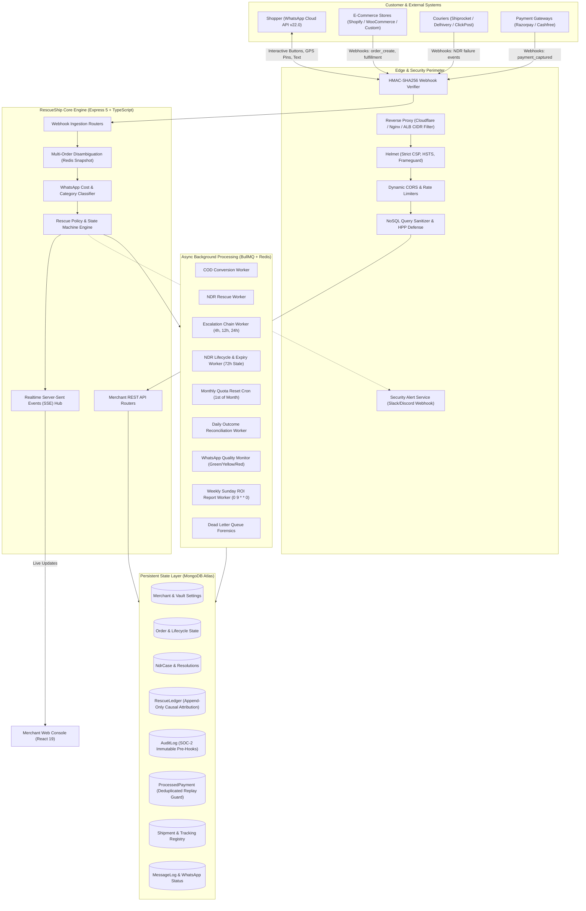

# 🚢 RescueShip — Comprehensive Technical & Operational Architecture Report

---

## Executive Summary

**RescueShip** is an enterprise-grade autonomous Cash-on-Delivery (COD) conversion and Non-Delivery Report (NDR) rescue engine purpose-built for the Indian Direct-to-Consumer (D2C) e-commerce ecosystem. 

In India, D2C brands typically experience 18% to 25% of all COD orders falling into **Return to Origin (RTO)**. When a package is returned, the merchant suffers a direct sunk loss of ₹140 to ₹250+ per parcel (forward freight, reverse freight, packaging damage, and 8–14 days of inventory lockup in return transit). Couriers often attempt deliveries at sub-optimal times, record vague remarks ("Customer unavailable", "Premises locked", "Incomplete address"), and charge double freight upon return.

RescueShip provides a **360° RTO Shield** that sits between merchant e-commerce platforms (Shopify, WooCommerce, Custom APIs), courier dispatch networks (Shiprocket, Delhivery, ClickPost, Shadowfax, Ekart, BlueDart), payment gateways (Razorpay, Cashfree), and the consumer over the **Meta WhatsApp Cloud API (v22.0)**. It automates:
1. **Pre-Dispatch COD-to-Prepaid Conversion** (instant UPI discounts and dynamic payment links).
2. **In-Transit NDR Rescue & 3-Mode Smart Address Correction** (Google Maps GPS pin capture, Indian colloquial address parsing with Gemini AI, and automated reattempt rescheduling pushed directly to courier driver handsets).
3. **Courier Fake Remark Detection & Fraud Intercept** (IST odd-hour checks, sub-15-minute speed runs, and customer denial heuristics).
4. **Doorstep COD Balance Adjustment & Partial Pay Verification** (reducing collectable COD amounts or securing a ₹49/₹99 advance reattempt commitment).
5. **Multi-Order Customer Inbound Disambiguation** (resolving customer replies when multiple orders are active in the session window without race conditions).
6. **Meta Marketing-Rate Trap Protection** (differentiating ₹0.14 utility vs. ₹0.88 marketing templates to eliminate unexpected messaging cost surges).
7. **Weekly Automated Sunday ROI Reports** (pushing automated performance summaries via WhatsApp to store owners).
8. **Attribution-Grade Rescue Ledger & Causal Lift Holdout Testing** (measuring true RTO reduction against a control group for verifiable ROI).

---

## 1. System Architecture & High-Level Topology



---

## 2. End-to-End Operational Lifecycle & Workflows

### 2.1 Pre-Dispatch: COD-to-Prepaid Conversion Workflow
1. **Order Ingestion**: When a shopper places a COD order on Shopify or WooCommerce, an incoming webhook (`orders/create`) hits `/webhooks/shopify` or `/webhooks/woocommerce`.
2. **Eligibility Check**: `order.service.ts` verifies that COD conversion is enabled, order value exceeds `minOrderValue`, and the merchant has available rescue credits.
3. **Discount & Link Generation**: If configured, a flat or percentage discount (e.g., ₹50 or 5%) is deducted. A dynamic payment link is generated through the merchant's connected Razorpay or Cashfree account.
4. **WhatsApp Dispatch**: A Meta-approved utility/marketing template (`cod_convert_en` or `cod_confirm_en`) is dispatched with a redirector link (`/r/pay/:id`) and UPI QR code.
5. **Payment Captured**: Upon customer payment, the gateway triggers `/webhooks/razorpay` or `/webhooks/cashfree`.
6. **Platform & Courier Synchronization**:
   - The order status in Shopify is updated to `paid` with a recorded financial transaction (`kind: 'sale'`).
   - Order tags (`RescueShip_Prepaid`, `Max_Refund_₹X`) and refund protection notes are attached.
   - If already manifested with a courier, the doorstep COD collection amount is amended to ₹0 via `cod-adjustment.service.ts`.
   - Real-time SSE alert notifies the merchant dashboard, and an automated WhatsApp confirmation is delivered to the customer.

### 2.2 In-Transit: Autonomous NDR Rescue & 3-Mode Address Correction
When a courier delivery attempt fails:
1. **Carrier Webhook Ingestion**: An NDR webhook arrives from Shiprocket, Delhivery, or ClickPost.
2. **Fake Remark Evaluation**:
   - **Time Heuristic**: Deliveries attempted outside 8:00 AM – 10:00 PM IST receive a suspicion penalty score (+0.5).
   - **Speed Run Heuristic**: Attempts marked within 15 minutes of "Out for Delivery" receive a penalty score (+0.5).
   - A score $\ge 0.5$ triggers a fake delivery flag in the merchant dashboard and prioritizes re-routing.
3. **Holdout & Pilot Control Group Check**: If configured in `rescuePolicy`, a percentage of failed orders (e.g., 5%) are withheld as a control group (`holdout`) to calculate causal RTO reduction.
4. **WhatsApp Intercept (< 60 seconds)**: The customer receives an interactive WhatsApp template (`ndr_rescue_en` / `ndr_rescue_hi`) offering 3 action buttons:
   - **Reschedule**: Choose reattempt date (Tomorrow 9 AM – 12 PM).
   - **Update Address**: Triggers 3-Mode Smart Address Correction.
   - **Cancel Order**: Cancels order immediately, saving reverse shipping friction and issuing an incentive coupon (`COMEBACK150`).
5. **3-Mode Address Correction Execution**:
   - **Mode 1 (Location Pin)**: Customer drops a WhatsApp GPS pin. RescueShip reverse-geocodes coordinates via OpenStreetMap Nominatim into structured house/street data.
   - **Mode 2 (Text Address)**: Customer types an address. Analyzed via Indian colloquial patterns (e.g., *"behind Shiv Mandir, 2nd floor, call at gate"*). If configured, Google Gemini AI extracts landmark, driver note, and 6-digit pincode.
   - **Mode 3 (Hybrid Both - Recommended)**: Step 1 collects GPS pin $\rightarrow$ Step 2 collects tower/flat/landmark details $\rightarrow$ Combines into a high-precision delivery coordinate pushed directly into the courier API (Shiprocket/Delhivery/ClickPost).
6. **Driver Handset Synchronization**: RescueShip calls the courier reattempt/address API, updating the rider's delivery app before the next morning's run sheet.

### 2.3 Semi-Terminal State: "RTO Arrest"
Even if a courier initiates return proceedings (`rto_initiated`), RescueShip does not immediately treat the parcel as lost. The state machine treats `rto_initiated` as a **rescueable semi-terminal state**. If customer engagement occurs before the package departs the destination delivery hub (e.g. paying online or verifying their presence), RescueShip attempts an **RTO Arrest** by rescheduling delivery and amending carrier instructions before the line-haul return begins.

### 2.4 Doorstep COD Adjustment & Partial Pay Engine
- **Partial Pay Opt-In**: Merchants can activate Partial Pay (`settings.partialPay`), requiring a nominal commitment deposit (e.g. ₹49 or ₹99) via UPI before a failed package is reattempted.
- **Doorstep Balance Adjustment**: When a partial or full payment is received for an active shipment, `cod-adjustment.service.ts` calls the carrier API to amend the collectable amount.
- **Overpayment & Reconciled Fallback**: Overpayments are automatically clamped, and if a courier rejects programmatic balance reduction, a manual intervention flag (`COD_AMENDMENT_MANUAL_REQUIRED`) is logged with an immediate dashboard alert.

### 2.5 Multi-Order Inbound Disambiguation
When a customer who has multiple active orders in transit replies to WhatsApp, `rescue-matching.service.ts` catches the ambiguity. It freezes a candidate order snapshot in Redis (`wa_disambig:{merchantId}:{phone}`) and dispatches an interactive numbered menu:
```
You have more than one active order. Please reply with the number:
1. Order ending 4210 (Blue Linen Shirt)
2. Order ending 8912 (Leather Boots)
```
When the customer replies with `1` or `2`, the system resolves the exact order reference without candidate-sliding race conditions.

---

## 3. Backend Architecture & Modules Deep-Dive

### 3.1 Technology Stack & Runtime
- **Runtime**: Node.js 20+ with TypeScript 5.x / 6.x running on Express 5.2.
- **Primary Database**: MongoDB 6.0+ via Mongoose 9.7 with compound indexing and partial filters.
- **Cache & Message Broker**: Redis 6.2+ via `ioredis` with TLS support.
- **Job Orchestration**: BullMQ v5.79 with exponential backoff, dead-letter queues, and atomic state transitions.
- **Security & Cryptography**: AES-256-GCM authenticated credential encryption, SHA-256 HMAC webhook verification, Helmet, Express-Mongo-Sanitize, HPP.
- **External Communications**: Meta WhatsApp Cloud API (v22.0 Graph API), Nodemailer & Google OAuth2 Gmail REST API.

### 3.2 Database Schema Architecture

| Collection / Model | Purpose & Critical Attributes | Indexing & Constraints |
| :--- | :--- | :--- |
| **`Merchant`** | Multi-tenant merchant profile, credential vault (encrypted third-party tokens), notification settings, billing tier, onboarding milestones, and quality monitor stats. | Unique on `email`. Compound indexes on status and billing. |
| **`Order`** | Central order ledger tracking monetary values, delivery status (`new`, `cod_conversion_sent`, `converted_to_prepaid`, `ndr_detected`, `ndr_rescued`, `delivered`, `rto`), AWB tracking, payment link IDs, and address update state. | Unique `{ merchantId: 1, externalOrderId: 1 }`. Partial unique `{ merchantId: 1, awb: 1 }` (non-null strings). Compound `{ merchantId: 1, status: 1, createdAt: -1 }`. |
| **`NdrCase`** | First-class NDR event tracker. Tracks carrier failure remarks, failure classification categories (`PREMISES_LOCKED`, `CUSTOMER_NOT_AVAILABLE`, `ADDRESS_ISSUE`), customer response type, carrier sync status, and estimated loss prevented. | Compound `{ merchantId: 1, awb: 1, status: 1 }`, `{ status: 1, createdAt: -1 }`. |
| **`RescueLedger`** | Append-only, attribution-grade ledger without TTL. Preserves pilot holdout outcomes, natural delivery outcomes, fake remark scores, and Meta messaging costs for performance pricing and dispute settlements. | Indexed on `{ merchantId: 1, pilotId: 1, flaggedAt: -1 }`. |
| **`DeliveryAttempt`** | Historical record of every delivery scan received from carrier webhooks with raw payloads, timestamps, and fake remark evaluations. | Indexed on `{ merchantId: 1, awb: 1, attemptTime: -1 }`. |
| **`Shipment`** | Granular package status normalization (`awb_generated`, `in_transit`, `out_for_delivery`, `ndr_detected`, `delivered`, `rto_initiated`), COD amendment history, and quarantine flags. | Unique on `{ merchantId: 1, awbNumber: 1 }`. |
| **`ProcessedPayment`** | Durable idempotency registry recording external payment IDs (`pay_xxx`) and event IDs to guarantee one-shot subscription provisioning and prevent replay attacks across sessions. | Unique `{ provider: 1, externalId: 1 }`. |
| **`AuditLog`** | SOC-2 compliant immutable event trail. Pre-hooks block any `updateOne`, `updateMany`, `deleteOne`, or `deleteMany`. Auto-expires after 90 days via MongoDB TTL index. | Compound `{ merchantId: 1, timestamp: -1 }`, TTL `{ timestamp: 1 }` (7,776,000s). |
| **`MessageLog`** | Complete history of outbound and inbound WhatsApp communications, recording `metaMessageId` (wamid), delivery status callbacks (`sent`, `delivered`, `read`, `failed`), and orphan message flags. | Unique sparse on `metaMessageId`. Compound `{ merchantId: 1, customerPhone: 1, createdAt: -1 }`. |
| **`WhatsAppTemplate`**| Catalog of registered Meta message templates per merchant with language, category, status (`approved`, `pending`, `rejected`), buttons, and components. | Compound `{ merchantId: 1, templateName: 1 }`. |
| **`BillingEvent`** | Ledger of billable consumption actions (e.g., rescue credits deducted per template sent, plan upgrades). | Indexed on `{ merchantId: 1, eventType: 1, timestamp: -1 }`. |
| **`WebhookEvent`** | Ingested raw webhook deduplication log for carrier and gateway callbacks. | Indexed on `{ source: 1, eventId: 1, createdAt: -1 }`. |

### 3.3 Core Services Catalog (`src/services/`)
- **`ndr.service.ts`**: Central NDR pipeline coordinating remark classification, fake attempt scoring, policy evaluation (`RescuePolicy`), WhatsApp dispatch, and customer response processing.
- **`order.service.ts`**: COD-to-prepaid conversion workflow, Razorpay/Cashfree payment link creation, UPI QR generation, and platform ledger updates (Shopify transactions/tags & WooCommerce notes).
- **`address-correction.service.ts`**: 3-Mode address engine orchestrating Nominatim reverse geocoding, Gemini AI instruction parsing, and carrier API synchronization.
- **`courier/cod-adjustment.service.ts`**: Idempotent doorstep COD balance modification, overpayment clamping, and carrier manual fallback flagging.
- **`state-machine/order-state-machine.service.ts`**: Enforces legal state transitions, rejects stale out-of-order webhook timestamps, and safeguards terminal states.
- **`whatsapp/whatsapp-dispatcher.service.ts`**: Outbound WhatsApp engine implementing rate-limiting, 4-hour cooldown windows, 3-attempt maximum caps, and atomic credit deductions.
- **`whatsapp-cost.service.ts`**: Meta conversation category classifier preventing the **marketing-rate trap** (~₹0.88 vs ~₹0.14 utility) and accumulating projected monthly Meta spend.
- **`rescue-matching.service.ts`**: Solves ambiguous inbound messages when customers have multiple active orders, providing frozen candidate snapshots.
- **`analytics/roi-calculator.service.ts`**: Calculates merchant financial metrics: RTO fees saved, net revenue recovered, and return rate drops.
- **`subscription.service.ts`**: Server-authoritative SaaS billing manager coordinating Razorpay orders, recurring mandates, payment verification, and order quota enforcement.
- **`email.service.ts`**: Dual-channel email system (Google OAuth2 Gmail REST API over HTTPS port 443 + Nodemailer SMTP fallback) dispatching retailer confirmations, setup alerts, and password resets.
- **`security-alert.service.ts`**: Dispatches out-of-band security alerts to Slack/Discord/Opsgenie upon detecting cross-tenant IDOR probes or circuit breaker trips.
- **`realtime.service.ts`**: Server-Sent Events (SSE) server streaming real-time order lifecycle changes to connected merchant browser sessions.
- **`gemini.service.ts`**: AI parsing engine translating colloquial Indian delivery instructions into clean addresses, landmarks, and rider notes.
- **`sandbox.service.ts`**: Manages simulated delivery failures, test pulse rescues, and graduation criteria.

### 3.4 BullMQ Background Workers & Cron Jobs (`src/jobs/`)
1. **`codConversion.job.ts`**: Asynchronously executes COD discount incentive calculations, payment link creation, and WhatsApp dispatch.
2. **`ndrRescue.job.ts`**: Evaluates NDR policy, records `NdrCase`, and dispatches initial rescue messages.
3. **`escalation.job.ts`**: Multi-tier escalation worker managing delayed jobs at 4 hours, 12 hours, and 24 hours. Automatically cancels if the customer responds.
4. **`weeklyRoiReport.job.ts`**: Scheduled cron executing **every Sunday at 9:00 AM (`0 9 * * 0`)**, compiling weekly rescue metrics and sending an automated WhatsApp performance summary to the merchant owner.
5. **`ndr-lifecycle.job.ts`**: Daily job auditing open NDR cases and auto-expiring tickets unresolved after 72 hours.
6. **`monthlyReset.job.ts`**: Cron job executing on the 1st of every month to reset `currentMonthOrders` across all merchants.
7. **`reconciliation.job.ts`**: Daily outcome reconciliation comparing carrier terminal deliveries against `RescueLedger` records to compute verified ROI.
8. **`quality-monitor.job.ts`**: Monitors Meta WhatsApp Business phone number quality ratings (`GREEN`, `YELLOW`, `RED`) to prevent spam penalties.
9. **`template-poller.job.ts`**: Periodically checks Meta Graph API for template approval updates.
10. **`deadLetter.job.ts`**: Retains exhausted BullMQ jobs for operational debugging.

### 3.5 Security & Compliance Architecture
- **Tenant Isolation Guarantee**: IDOR prevention enforced across all queries by scoping to `merchantId: req.merchant.merchantId`.
- **Zero Raw Secrets Storage**: All third-party credentials (Shopify tokens, Shiprocket passwords, Meta tokens, Razorpay key secrets) are encrypted with AES-256-GCM.
- **Webhook HMAC Enforcement**: Webhooks verify cryptographic signatures (`X-Hub-Signature-256`, `X-Shopify-Hmac-Sha256`, `X-Razorpay-Signature`, `X-WC-Webhook-Signature`).
- **Session Revocation**: JWT payloads bind to `merchant.tokenVersion`. Updating passwords or credentials increments this value, instantly terminating active sessions across all devices.
- **Global Circuit Breakers**: `settings.globalPause` immediately blocks all automated outbound WhatsApp dispatches and carrier calls during operational emergencies.

---

## 4. Frontend Architecture & User Experience

### 4.1 Technology Stack & Framework
- **Core**: React 19 with Vite 8, TypeScript 6, React Router DOM v7.
- **Animation & Micro-interactions**: `motion/react` (Framer Motion v12) for spring-physics tab indicators, section reveals, and magnetic buttons.
- **Smooth Scrolling**: Lenis v1.3 for cinematic viewport momentum.
- **Icons**: Lucide React + custom standalone SVGs (`src/components/icons/`).
- **Data Visualizations**: Recharts v3 for revenue recovery trends, conversion rate metrics, and carrier performance bars.
- **Accessibility & Quality**: WCAG 2.1 AA compliant, strict Stylelint enforcement against raw RGBA values, automated Playwright and Axe-core E2E tests.

### 4.2 Design System Specification (`DESIGN.md`)
Derived from the dark mission-control aesthetic (`frontend/src/index.css`):
- **Surfaces**: Canvas Void (`#050508`), Card Surface (`rgba(255, 255, 255, 0.03)`), Input Background (`#12121a`), Border (`rgba(255, 255, 255, 0.08)`).
- **Phosphor Accents**: Indigo (`#4f46e5`), Emerald (`#10b981`), Amber (`#f59e0b`), Rose (`#f43f5e`), Danger Red (`#ef4444`).
- **Typography Scale**: `Space Grotesk` (headings/display), `Inter` (body copy), `JetBrains Mono` (telemetry logs, order IDs, AWBs, currency).
- **Spatial Grid**: 4px base scale (`--space-1` = 4px, `--space-2` = 8px, `--space-4` = 16px, `--space-6` = 24px, `--space-8` = 32px, `--space-12` = 48px).

### 4.3 Frontend Page Directory (`frontend/src/pages/`)

| Page Component | Route | Functionality |
| :--- | :--- | :--- |
| **`LandingPage.tsx`** | `/` | Conversion-focused landing page with Lenis smooth scrolling, narrative Story Scenes (Cost Scene, Rescue Scene), dynamic carrier marquee, and interactive ROI calculator. |
| **`LoginPage.tsx`** | `/login` | Email/password sign-in and Google OAuth 2.0 Single Sign-On with session token storage. |
| **`RegisterPage.tsx`** | `/register` | New merchant onboarding registration with store platform selection. |
| **`ForgotPasswordPage.tsx`** / **`ResetPasswordPage.tsx`** | `/forgot-password`, `/reset-password` | Self-serve password reset requesting a 15-minute single-use SHA-256 token delivered via email, invalidating all other active JWT sessions upon completion. |
| **`DashboardPage.tsx`** | `/dashboard` | Central telemetry hub featuring live revenue counters (`AnimatedCounter`), COD conversion stats, active NDR count, Recharts charts, and live SSE event toasts. |
| **`OrdersPage.tsx`** | `/orders` | Order management table with carrier, date, and status filters, CSV export with formula injection sanitization, and click-to-open forensic slide-over. |
| **`OnboardingPage.tsx`** | `/onboarding` | 4-stage interactive wizard connecting Store (Shopify/WooCommerce), WhatsApp (Meta Embedded Signup / Manual), Courier (Shiprocket/Delhivery), and Gateway (Razorpay/Cashfree), concluding with a live test pulse to the owner's phone. |
| **`SandboxPage.tsx`** | `/sandbox` | Simulated NDR testing ground allowing merchants to trigger simulated delivery failures and view WhatsApp payloads without modifying live courier accounts. Features a 3-rescue graduation gate. |
| **`SettingsPage.tsx`** | `/settings` | Central settings panel for credential management (masked with `********`), automation toggles, escalation chain customization, partial pay rules, and emergency global pause. |
| **`TemplatesPage.tsx`** | `/templates` | Meta WhatsApp template registry detailing template components, languages (`en`, `hi`), approval statuses, and one-click resubmission triggers. |
| **`BillingPage.tsx`** | `/billing` | Subscription checkout interface displaying plan tiers (Starter, Growth, Scale, Fleet), billing cycle options (Quarterly, Semi-Annual, Annual), and Razorpay payment modal integration. |
| **`AuditLogsPage.tsx`** | `/audit-logs` | SOC-2 immutable append-only audit trail viewer showing every webhook, WhatsApp dispatch, and courier API call. |
| **`DocsPage.tsx`** | `/docs` | Built-in technical documentation covering webhook specifications, payload samples, and cURL commands. |

### 4.4 Standalone UI Components (`frontend/src/components/`)
- **`AiAddressDecoder.tsx`**: Live scenario workbench demonstrating Indian colloquial address parsing, landmark extraction, and courier dispatch payloads.
- **`TelemetryDrawer.tsx`**: Slide-over drawer rendering second-by-second delivery audit trails, fake remark suspicion scores, customer conversation transcripts, and raw MongoDB JSON payloads.
- **`RescueMetrics.tsx`**: Visual breakdown of RTO cost savings, net recovered revenue, and return rate drops.
- **`SetupGuide.tsx`**: Embedded checklist tracking integration health across store, messaging, logistics, and payment channels.
- **`PricingComparisonModal.tsx`**: Comparative modal detailing plan limits, custom carrier support, and feature gating.

---

## 5. Operations, DevOps & Verification Tooling

### 5.1 Verification Scripts (`scripts/`)
- **`simulate-all-possibilities.ts`**: Comprehensive test harness simulating every edge case: COD-to-prepaid conversion, fake remark late-night triggers, location pin updates, cancellation requests, and carrier reattempt failures.
- **`verify-adversarial-fixes.ts`**: Adversarial test suite validating IDOR boundaries, ReDoS query safety, formula injection protections, and cross-merchant payment replays.
- **`master-e2e-test.ts`**: End-to-end integration test validating the complete lifecycle from order ingestion to carrier reattempt.
- **`test-shiprocket.ts`**: Dedicated Shiprocket API authentication and NDR action dispatch verification script.
- **`generate-design-md.cjs`**: Automated design token extractor parsing `frontend/src/index.css` into `DESIGN.md`.
- **`get-gmail-token.js`**: Interactive OAuth2 helper for configuring Google API tokens for email delivery over port 443.

### 5.2 Production Deployment & Keepalive
- **Frontend Web App**: Hosted on **Netlify** (`https://rescueship.netlify.app`, Site ID: `50a5e507-c497-49b0-b441-7251fe527838`).
- **Backend API Engine**: Hosted on **Render** (`https://rescueship.onrender.com`, Service ID: `srv-dah653142hec73evd020`).
- **Automated Keepalive**: Configured via `cron-job.org` pinging `/health` every 5 minutes so Render instances never experience cold-start latency.
- **Email Infrastructure**: Google OAuth2 Gmail REST API over HTTPS (Port 443) using `konarkofficial@gmail.com`. Automatically dispatches 24–48h confirmation emails to retailers upon integration requests, accompanied by immediate admin alerts to `konarkofficial@gmail.com`.
- **Credential Vault**: Isolated outside Git in `CREDENTIALS.md`.

---

## 6. Commercial Comparison & Merchant Value Matrix

| Capability / Dimension | Courier In-House Bots (Delhivery / Shadowfax / Ekart) | Aggregator Bots (Shiprocket Engage) | **RescueShip Platform** |
| :--- | :--- | :--- | :--- |
| **Carrier Independence** | ❌ Locked to single carrier | ⚠️ Locked to Shiprocket manifests | ✅ **Universal**: Works across Shiprocket, Direct Delhivery, ClickPost, and multi-courier setups. |
| **Commercial Alignment** | ❌ Conflicted: Couriers profit on reverse shipping fees. | ⚠️ Conflicted: Aggregators earn cuts on return freight. | ✅ **100% Merchant Aligned**: Subscription model aligned strictly with RTO reduction. |
| **3-Mode Address Correction** | ❌ Basic text capture | ⚠️ Reattempt date button only | ✅ **3-Mode Engine**: GPS Pin + Text + Hybrid Geocoding with Gemini AI. |
| **Pre-Dispatch COD Conversion** | ❌ None | ⚠️ Limited | ✅ **Dynamic UPI QR Links**: Dynamic payment links with automated discount incentives. |
| **Doorstep COD Adjustment** | ❌ None | ❌ None | ✅ **Automated Balance Amendment**: Amends rider run-sheets upon online payment. |
| **Fake Remark Intercept** | ❌ Ignored | ❌ Ignored | ✅ **Active Fraud Detection**: Heuristic scoring on odd hours and speed-runs. |
| **Attribution & Holdouts** | ❌ None | ❌ None | ✅ **RescueLedger**: Proves statistical causal lift against control groups. |
| **Weekly WhatsApp ROI Report** | ❌ None | ❌ None | ✅ **Automated Sunday Briefing**: Dispatches weekly saved freight numbers to store owners. |

---

*Report generated for RescueShip Production Deployment. ISC License. Copyright © 2026 RescueShip Inc. All rights reserved.*
