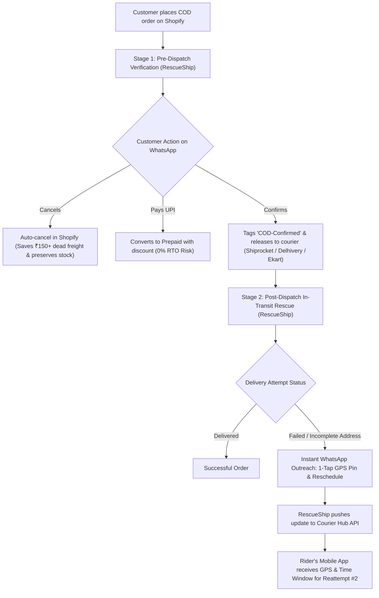
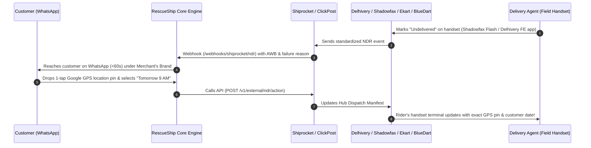

# RescueShip · Master Client Pitch & Meeting Guide
## The Complete Sales, Architecture & Objection-Handling Playbook for D2C Retailer Discussions

> **Purpose**: This is the single, all-in-one document for client meetings, sales pitches, and investor/retailer discussions. It covers the core pitch, technical architecture, multi-carrier compatibility, delivery boy mechanics, commercial battlecards, and mathematical ROI.

---

## 1. The 30-Second Elevator Pitch & Core Problem

### The Pitch
> *"Indian D2C brands lose 18% to 25% of all COD revenue to Return-to-Origin (RTO). Couriers promise 3 attempts, but reattempt blindly with the exact same bad address or at the exact same wrong time of day, billing you double freight when it fails.*
> 
> *RescueShip connects directly to your Shopify store and your shipping partners (Shiprocket, Delhivery, Shadowfax, Ekart, BlueDart). When an attempt fails, our WhatsApp engine reaches the customer within 60 seconds under your own brand to capture their live Google GPS pin, preferred reattempt day, or instant UPI payment—and pushes that directly into the courier’s system before the next attempt.*
> 
> *We save 30% to 40% of doomed orders, paying for our subscription with a single saved parcel a week."*

### The Real Cost of RTO for Indian Retailers:
Every single returned package burns:
1. **Forward Freight**: ₹50 – ₹80
2. **Reverse Freight**: ₹50 – ₹80 (Couriers charge you double freight for bringing back a failed order)
3. **Packaging Damage**: ₹20 – ₹30 (Damaged box, tape, and inspection labor)
4. **Inventory Lockup**: 8 – 14 days stuck in return trucks where it cannot be sold to another customer.
- **Total Direct Sunk Loss Per Return: ₹140 to ₹250+**

---

## 2. The 360° RTO Shield (Pre-Dispatch + In-Transit)

RescueShip does not just wait for delivery failures on the road. We protect the merchant across the entire lifecycle:

### Stage 1: Pre-Dispatch Verification & COD-to-Prepaid Conversion
- **Instant Outreach**: Automated WhatsApp ping within 2 minutes of checkout.
- **Intent Check**: Shopper confirms intent or cancels impulse/duplicate orders *before* the warehouse packs the box.
- **Incentive Engine**: Offers instant UPI payment discount (e.g., *"Pay ₹50 less via UPI to confirm"*).
- **Shopify Sync**: Auto-tags orders (`COD-Confirmed`, `COD-Cancelled`, `COD-Address-Verified`).

### Stage 2: In-Transit NDR Delivery Rescue
- **Real-Time Detection**: Webhook catches courier delivery failure within seconds.
- **Root-Cause Resolution**: Collects live GPS pin, landmark, or specific date hold.
- **2-Way Carrier Update**: Calls courier API to update the delivery boy's morning run-sheet.

---

## 3. Multi-Carrier Compatibility: How It Connects to All Courier Apps

### Client Question:
> *"We use Delhivery for North India, Shadowfax for Metros, Ekart for Central India, and BlueDart for high-value orders (often routed via Shiprocket). All these delivery agents use different apps on their phones. How does your app connect to all of them?"*

### Your Answer:
> *"None of these delivery boys talk to RescueShip directly—and they don't have to. You don't have to change your courier contracts."*

1. **Rider App Diversity**: The rider can be using the **Delhivery FE App**, **Shadowfax Flash App**, **Ekart Last-Mile App**, or a **BlueDart scanner**. When he marks a failure code, the courier's server standardizes it into an NDR webhook.
2. **Aggregator Bridge**: Through Shiprocket or direct courier APIs, RescueShip intercepts failed shipments across **every single courier** in one unified command center.
3. **Closing the Loop**: When the customer responds on WhatsApp, RescueShip calls the courier’s action endpoint. The courier's central dispatch system **pushes the customer's GPS pin and date window straight onto that rider’s phone screen for tomorrow's run.**

---

## 4. Master Feature Comparison: RescueShip vs. Courier In-House Bots

| Capability / Dimension | Courier In-House Bots (Shadowfax / Ekart / Delhivery) | Aggregator Bot (Shiprocket Engage) | **RescueShip Platform** |
| :--- | :--- | :--- | :--- |
| **Multi-Carrier Independence** | ❌ **Locked to 1 Courier**: Only works on their own shipments. Useless for orders on other couriers. | ⚠️ **Locked to Shiprocket**: Only works for orders manifested inside Shiprocket. | ✅ **Universal ("The Switzerland of Logistics")**: Works seamlessly across Shiprocket, Direct Delhivery, ClickPost, and multi-courier setups. |
| **Commercial Alignment** | ❌ **Severe Conflict of Interest**: Couriers bill double freight on RTOs (forward + reverse). They profit when packages return. | ⚠️ Aggregator earns commissions on reverse freight. | ✅ **100% Merchant-Aligned**: RescueShip only wins when the retailer prevents and rescues RTOs. |
| **"Fake Attempt" Detection** | ❌ **Will Never Audit Themselves**: Delivery boys often fake remarks ("Customer Refused") to hit daily quotas. Courier bots will never admit their riders lied. | ⚠️ Generic dispute tracking with sluggish escalation. | ✅ **Aggressive Fraud Audit Engine**: Discrepancy detection between rider remarks and customer replies. Auto-escalates fake remarks to hub managers. |
| **Branding on WhatsApp** | ❌ **Courier Spam**: Messages arrive from "Shadowfax Logistics" or "Ekart Delivery", confusing shoppers. | ⚠️ Generic aggregator templates. | ✅ **Whitelabel Merchant Identity**: Messages arrive with the merchant's store brand name, driving 2.5x higher response rates. |
| **Deep Shopify Integration** | ❌ **No Store Tagging**: Won't update order tags, customer profiles, or store inventory. | ⚠️ Basic tags with delayed syncing. | ✅ **Real-Time Store Sync**: Automatically tags `COD-Confirmed`, `Fake-Attempt-Flagged`, `Address-Verified`, and syncs fulfillment holds. |
| **COD-to-Prepaid Conversion** | ❌ None (They only do delivery tracking). | ⚠️ Generic payment links. | ✅ **Integrated UPI / Razorpay / Cashfree Engine**: Dynamic QR codes and custom discount incentives (e.g., "Pay ₹50 less via UPI to confirm"). |
| **Live GPS Location Drops** | ❌ Text-only forms requiring manual typing. | ⚠️ Text forms. | ✅ **WhatsApp Native Attachment**: Shopper drops a 1-tap live GPS pin, eliminating vague text directions. |

---

## 5. The 4 Big Objections & Field-Tested Battlecards

### Objection 1: "If couriers have OTP-based rejection and will reattempt delivery anyway, why do I need RescueShip? Is RescueShip just a cancel button?"
*(CRITICAL TALKING POINT — USE THIS EXACT EXPLANATION)*

> **Your Response**:
> 
> **1. The Courier OTP Loophole**:
> *"Couriers only mandate an OTP if the delivery boy claims 'Customer explicitly refused the order'. But delivery boys know this. What do they mark instead?
> - 'Customer Not Reachable' (No OTP required)
> - 'Address Incomplete / Landmark Missing' (No OTP required)
> - 'Door Locked / Customer Unavailable' (No OTP required)
> The courier system accepts these remarks without asking for any OTP, bypassing the safeguard completely."*
> 
> **2. The 'Blind Reattempt' Disaster**:
> *"Couriers promise: 'We will attempt delivery 3 times before initiating RTO.' But here is what actually happens on the ground without RescueShip:
> - **Day 1**: Rider tries at 2 PM. Address says 'Flat 204, near Shiv temple'. Rider can't find the temple or customer is at work. Attempt 1 Fails.
> - **Day 2**: The courier hub hands the package back to the rider. **The rider has zero new information.** He still doesn't know where the temple is, and the customer is at work at 2 PM again. Attempt 2 Fails.
> - **Day 3**: Rider arrives at the same wrong time with the same bad address. Attempt 3 Fails.
> - **Day 4**: **RTO initiated!** The parcel is put on a 7-day return truck back to your warehouse. You are billed ₹140 in two-way courier freight, and your stock was locked for 10 days for nothing."*
> 
> **3. Where RescueShip Breaks the 'Blind Reattempt' Cycle**:
> *"RescueShip does not exist to be a 'Cancel Button'. RescueShip exists because couriers reattempt blindly with broken information. We resolve the root cause before Attempt #2:*
> 
> | Failure Scenario | What Courier Default Does (Blind Reattempt) | What RescueShip Does (Resolved Reattempt) |
> | :--- | :--- | :--- |
> | **Incomplete / Confusing Address** (~38% of RTOs) | Delivery boy fails 3 times looking for the house. Parcel returns to origin. | Customer taps **'Share Location'** on WhatsApp. RescueShip feeds the **exact Google GPS coordinates & building landmark** into the courier system before Attempt #2. **Delivered.** |
> | **Customer Out of Town / At Work** (~30% of RTOs) | Courier blindly tries Thursday & Friday while customer is out of town. Fails 3 times. | Customer taps: **'Deliver on Sunday'**. RescueShip places an **immediate delivery hold on the AWB** until Sunday so attempts are not wasted. **Delivered.** |
> | **No Cash at Home for COD** (~15% of RTOs) | Rider demands cash. Customer has no cash or change. Fails. | RescueShip sends an **instant UPI payment link** on WhatsApp. Customer pays online from office. Rider hands parcel to watchman or neighbor. **Delivered.** |
> | **Customer Genuinely Doesn't Want It** | Courier wastes 3 attempts and 5 days before starting RTO. | Customer taps **`[Cancel Order]`**. RescueShip immediately stops reattempts on Day 1, saving 5 days of transit delay and returning inventory to shelf."*

---

### Objection 2: "Nobody clicks links in SMS from unknown numbers, and calling the customer does no good because delivery boys already call."

> **Your Response**:
> 
> *"You are 100% right about SMS links. Click-through rates on SMS links in India are under 3% due to spam and phishing fears. That is why **RescueShip does NOT rely on SMS links**.*
> 
> *1. **Native Interactive Buttons**: On WhatsApp, RescueShip uses Meta's official interactive buttons (`[Reschedule Tomorrow]`, `[Share Location 📍]`, `[Cancel]`). The shopper never leaves WhatsApp or taps a weird URL.*
> *2. **Verified Brand Identity**: Messages arrive with your store's brand name and logo, not a random SIM card number.*
> *3. **Asynchronous Communication**: Delivery boys call for 3 seconds while driving or call at 2 PM when customers are in office meetings and reject Truecaller unknown numbers. WhatsApp sits in their inbox. At 6:30 PM, the customer checks their phone, sees your message, and taps 'Tomorrow after 6 PM' in 5 seconds."*

---

### Objection 3: "Shadowfax and Shiprocket already have an NDR dashboard. Why should I pay for RescueShip?"

> **Your Response**:
> 
> **1. The Multi-Carrier Reality**:
> *"You don't ship 100% of orders through Shadowfax. You use Delhivery for North India, Shadowfax for Metros, Ekart for Central India, and BlueDart for high-value orders. A Shadowfax bot leaves 60% of your catalog exposed. RescueShip is carrier-agnostic—we protect 100% of your shipments across all couriers under one brand."*
> 
> **2. The Freight Double-Billing Conflict**:
> *"When an order delivers, the courier charges ₹60 forward freight. When an order returns, the courier bills you forward + reverse freight (₹130–₹150). Couriers make double the freight revenue when packages return. Relying on a courier's captive bot to aggressively prevent returns is a conflict of interest. RescueShip's incentives are 100% aligned with your margins."*
> 
> **3. The 'Fake Attempt' Auditor**:
> *"Delivery boys regularly fake remarks ('Customer refused') to finish their shifts early. A courier's internal bot will never audit its own drivers. When a rider claims 'Customer refused', RescueShip asks the shopper: 'Did our rider attempt delivery today?' When they reply 'No, nobody came!', we flag the driver for fraud, file a dispute with the hub, and stop immediate RTO."*

---

### Objection 4: "What if I switch my default courier next month?"

> **Your Response**:
> 
> *"That's the beauty of RescueShip. If you move 5,000 orders from Shadowfax to Delhivery or Ekart next month, you don't lose a single customer conversation, metric, or automation rule. RescueShip remains your permanent control layer regardless of which courier carries the box."*

---

## 6. The Hard Math: Pricing vs. Real Retailer Savings

Indian merchants don't buy features—they buy math. Here is the exact return on investment:

| Tier | Monthly Volume Limit | Platform Fee | Estimated Monthly Sunk Loss Without RescueShip | Money Recovered by RescueShip (32% conservative rate) | Net Merchant ROI |
| :--- | :--- | :--- | :--- | :--- | :--- |
| **Starter** | Up to **1,000** orders | **₹1,299 / mo** | ~₹31,500 / mo | **~₹10,080 / mo** | **7.8x Plan Return** |
| **Growth** | Up to **5,000** orders | **₹3,499 / mo** | ~₹157,500 / mo | **~₹50,400 / mo** | **14.4x Plan Return** |
| **Scale** | Up to **12,000** orders | **₹7,999 / mo** | ~₹378,000 / mo | **~₹120,960 / mo** | **15.1x Plan Return** |
| **Fleet** | Up to **25,000** orders | **₹14,999 / mo** | ~₹787,500 / mo | **~₹252,000 / mo** | **16.8x Plan Return** |

*Assumptions: 65% COD ratio, 18% COD RTO rate, ₹250 combined sunk cost per failed delivery (courier 2-way freight + packaging).*

### The "1 Order Per Week" Anchor:
Tell the client:
> *"At ₹1,299/mo, RescueShip costs you just ₹325 per week. A single avoided RTO saves you ₹250 in dead shipping plus protects a ₹1,200 order. If RescueShip saves just ONE order a week, the platform is completely free."*

---

## 7. High-Impact Closing Questions for Founders & Ops Heads

Use these 3 questions to close the discussion:

1. **To the Founder / CEO**:
   > *"How many packages did you have in RTO last month? Multiply that by ₹140 in courier freight plus your packaging. How much margin did you lose simply because riders couldn't find the address or arrived when the buyer was at work?"*

2. **To the Operations / Logistics Head**:
   > *"How much time does your team waste every afternoon manually logging into Shiprocket, downloading NDR sheets, calling customers who reject unknown numbers, and filing courier disputes? What if that was 100% automated on WhatsApp?"*

3. **The Risk Reversal Close**:
   > *"We offer a 90-Day 'Pays-For-Itself' Guarantee. Connect your store today. If our verified delivery recoveries over 90 days don't exceed your subscription cost, we refund 100% of your money. Can we connect your store and courier right now?"*
