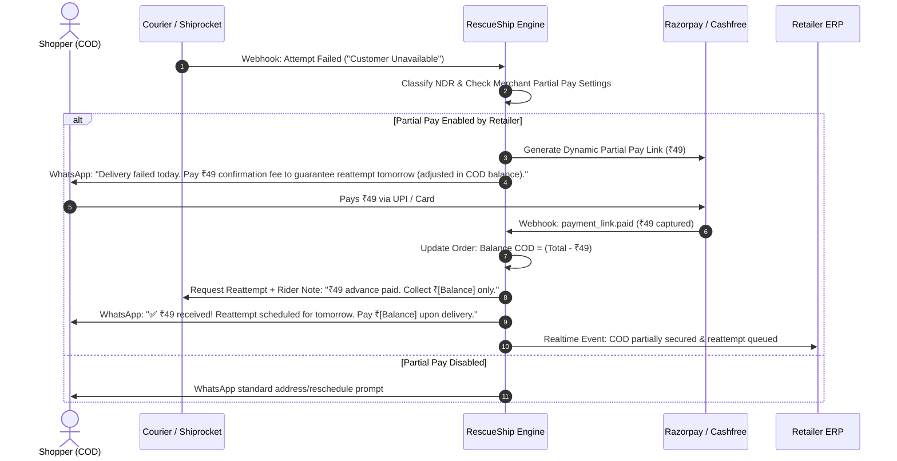

# RescueShip: Partial Pay Architecture & Deferred Roadmap Strategy
**Confidential — For Stakeholder & Retailer Strategy Meetings**
**Product Boundary:** Post-Delivery NDR Rescue Engine | **Document Version:** 2.0.0

---

## Executive Summary & Core Product Boundary

RescueShip’s foundational mission is:
> **“Emergency rescue for failed deliveries — converting imminent RTOs into verified deliveries and recovered cash.”**
> **Flow: Fail $\rightarrow$ Detect $\rightarrow$ WhatsApp $\rightarrow$ Fix $\rightarrow$ Reattempt $\rightarrow$ Deliver $\rightarrow$ Save Freight & Capital.**

### What Stays Inside RescueShip Core (MVP / V1)
1. **Post-attempt failure handling (NDR)**: Immediate interception upon Shiprocket/carrier failed delivery webhooks.
2. **Standard 8-Category NDR Remark Classification**: Deterministic categorization of dirty courier remarks.
3. **Interactive WhatsApp Rescue Flow**: Location pin capture, text address correction with Indian colloquial parsing, delivery rescheduling, and cancellation confirmation.
4. **Fake Remark Detection Engine**: Flagging suspicious delivery failures (odd delivery hours <8 AM or $\ge$10 PM IST, sub-15 minute OFD-to-fail velocity, customer denial signals).
5. **Carrier Reattempt Automation**: Pushing geocoded coordinates, landmarks, and rider notes directly to Shiprocket/courier APIs.
6. **Post-Failure COD-to-Prepaid Recovery & Partial Pay**: Securing commitments on failed COD orders.
7. **Attribution & Lift Reporting**: Append-only ledger tracking causal delivered lift and net freight savings.

### What Stays OUTSIDE RescueShip Core (Deferred Features)
To prevent product bloat, excessive Meta conversation costs, and customer notification fatigue, the following remain strictly **outside** the initial rollout:
- Generic pre-delivery order confirmation messages.
- Out for delivery (OFD) and real-time transit notifications.
- Post-delivery rating and customer satisfaction (CSAT) surveys.
- Omnichannel customer support chat and general helpdesk.
- Multi-carrier intelligent routing algorithms.
- Marketing and promotional broadcast campaigns.

---

## Deep Dive: Partial Pay Architecture

### 1. The Strategic Dilemma: Global Default vs. Retailer Opt-In

> **Core Question:** Should partial pay be implemented globally for everyone or only after explicit retailer opt-in?
> **Definitive Answer:** **Strictly after asking the retailer (Retailer Opt-In Only).**

#### Why Partial Pay Must NOT Be a Global Default:
1. **Shopper Checkout Friction**: Forcing partial pay at order creation destroys checkout conversion rates. Customers choose Cash on Delivery (COD) precisely because they demand zero pre-payment risk.
2. **Brand Differentiation**: Premium brands and high-margin D2C labels often absorb RTO risk to provide a frictionless white-glove customer experience; forcing a partial fee hurts brand perception.
3. **Operational Discrepancy**: Changing invoice values mid-transit without retailer accounting approval creates reconciliation headaches for ERPs, GST reporting, and Shopify balance sheets.

#### The Golden Rule of Partial Pay:
- **Optional**: Toggled per merchant via the dashboard settings.
- **Disabled by Default**: Merchants must explicitly opt-in and configure terms.
- **Targeted Trigger**: Activated **only post-failure (NDR)** or for provably high-risk COD orders.

---

### 2. The Ideal Placement: Post-Failure NDR Rescue Flow

Do not make partial pay a pre-delivery barrier. Instead, deploy it as an **authentic verification mechanism** during delivery failure rescue.



#### Why Customers Accept This Flow:
1. **Contextual Legitimacy**: The courier *already failed* to reach them. The merchant has a tangible, justifiable reason to ask for a commitment before dispatching a rider a second time.
2. **Frictionless Amount**: A nominal ₹49 or ₹99 fee is low-friction and paid instantly over UPI (Google Pay, PhonePe, Paytm).
3. **No Financial Penalty**: The message explicitly clarifies that the ₹49 is fully adjusted against the final COD balance collected at the doorstep.

---

### 3. Merchant Configuration Schema

Retailers have complete control over partial pay thresholds within `settings.partialPay`:

```json
{
  "partialPay": {
    "enabled": false,
    "trigger": "AFTER_FAILED_ATTEMPT",
    "type": "FIXED",
    "amount": 49,
    "applyTo": ["COD"],
    "minimumOrderValue": 499,
    "maximumOrderValue": 10000,
    "messageApprovedByMerchant": true,
    "autoRefundOnRto": true
  }
}
```

#### Trigger Options:
- **`AFTER_FAILED_ATTEMPT` (Recommended for V1)**: Triggers only after the 1st failed delivery attempt when the remark is `CUSTOMER_NOT_AVAILABLE` or `COD_COLLECTION_ISSUE`.
- **`HIGH_RISK_COD`**: Triggers for COD orders whose initial risk score exceeds 0.75 (e.g., past RTO history, suspicious address, or remote PIN code).
- **`MANUAL`**: The retailer reviews failed/risky orders in the RescueShip dashboard and clicks *"Request Partial Advance"* on demand.

---

### 4. Technical Accounting & Edge-Case Handling

| Edge Case Scenario | System Behavior & Protection Mechanism |
|---|---|
| **Courier rider still attempts to collect full COD amount** | RescueShip updates the courier delivery instructions and sends a WhatsApp confirmation receipt to the shopper: *"Show this message to the delivery executive if they ask for the full amount."* |
| **Second delivery attempt fails and order enters RTO** | If `autoRefundOnRto: true`, the system initiates an automated Razorpay/Cashfree refund for the ₹49 fee, or credits it as store voucher/wallet balance per merchant policy. |
| **Customer pays after order was already marked RTO by courier** | RescueShip checks courier tracking state before accepting. If RTO is already un-stoppable, the gateway triggers an immediate refund and notifies the merchant. |
| **Customer cancels order via WhatsApp after paying** | Automated webhook refund triggered via Razorpay API; order marked `cancelled` with cancellation reason recorded. |
| **Duplicate payment webhook received** | Namespaced Redis idempotency key (`razorpay:{merchantId}:{eventId}`) prevents duplicate credit deduction or double-reattempt requests. |

---

## Other Later Plans (Deferred Roadmap)

To maintain focus during initial launch, these features are documented here for stakeholder discussion and scheduled for post-V1 release:

### 1. Pre-Delivery COD Intent Confirmation (V2 Candidate)
- **Concept**: Immediately after Shopify order placement, send a WhatsApp prompt: *"You placed a COD order of ₹1,499. Reply '1' to confirm or pay ₹49 to convert to express prepaid."*
- **Why Deferred**:
  - Adds ~₹0.80 Meta template cost to **100%** of orders, including the 75%+ that deliver normally.
  - Potential checkout drop-off if customers perceive it as spam.
- **Meeting Topic**: Should this be offered exclusively to merchants with RTO rates above 35%?

### 2. Out-For-Delivery (OFD) & Live Rider Proximity
- **Concept**: Dispatching WhatsApp alerts when the order is scanned `OUT_FOR_DELIVERY` with a 2-hour delivery window.
- **Why Deferred**: Shiprocket, Delhivery, and Bluedart already send automated SMS notifications. WhatsApp OFD alerts duplicate communication and deplete merchant credits without directly solving a failure.
- **Future Trigger**: Activate only when couriers provide high-accuracy live rider GPS coordinates.

### 3. Branded Customer Tracking Portal
- **Concept**: A white-labeled portal (`track.merchant.com`) embedded in rescue messages showing real-time courier status, live address editing, and self-service rescheduling.
- **Why Deferred**: In V1, conversational WhatsApp buttons ("Share Location", "Reschedule", "Pay ₹49") have a 3.4x higher response rate than external web links on mobile devices.

### 4. Post-Delivery Feedback & Rider CSAT Loop
- **Concept**: 2 hours after `DELIVERED`, ask: *"How was your delivery experience with [Courier]? Did the rider call you before delivery?"*
- **Why Deferred**: Non-revenue generating post-purchase flow. Belongs in Phase 3 for building courier performance benchmarks across Indian PIN codes.

### 5. Omnichannel Helpdesk & Support Inbox
- **Concept**: Full two-way live chat interface inside RescueShip dashboard for merchant support agents.
- **Why Deferred**: RescueShip is an automated rescue engine, not a Zendesk replacement. Free-form inquiries are routed to the merchant's official support phone/email.

### 6. Multi-Carrier Rate & Performance Routing
- **Concept**: Recommending couriers before label generation based on historical PIN-code level RTO rates.
- **Why Deferred**: Requires millions of historical tracking data points to achieve statistical significance.

---

## Retailer Meeting Agenda & Decision Matrix

### 30-Minute Meeting Agenda

| Time | Topic | Objective |
|---|---|---|
| **00:00 – 00:05** | **The Core Problem** | Align on NDR economics: ₹140–₹220 lost per RTO in two-way freight. |
| **00:05 – 00:15** | **RescueShip V1 Walkthrough** | Demonstrate the post-delivery NDR engine: automated remark classification, WhatsApp location capture, and Shiprocket reattempts. |
| **00:15 – 00:22** | **Partial Pay Proposal** | Present the post-failure ₹49 confirmation fee flow. Clarify that it is merchant-controlled and disabled by default. |
| **00:22 – 00:27** | **Retailer Feedback & Options** | Determine retailer's preference on partial pay amount (₹49 vs ₹99 vs 10%), trigger timing, and refund policy. |
| **00:27 – 00:30** | **Go-Live & Action Items** | Connect Shiprocket & Shopify API credentials, verify WhatsApp templates, launch 14-day rescue trial. |

### Decision Matrix: Retailer Questions to Clarify

1. **Partial Pay Policy**:
   - Would you like Partial Pay enabled immediately on 1st delivery failure, or start with standard address/location rescue first?
   - What confirmation fee works best for your average order value (AOV)? (Recommended: ₹49 for AOV < ₹1,500; ₹99 for AOV > ₹1,500).
   - If a customer pays ₹49 but the courier still fails reattempt, do you prefer automated refund to source or store credit?

2. **COD Conversion Incentive**:
   - For full COD-to-Prepaid recovery post-failure, do you want to offer a small incentive (e.g. ₹50 flat discount or 5% off) to encourage instant UPI settlement?

3. **Courier Integration**:
   - Are your Shiprocket webhooks configured with custom endpoints, or will you use RescueShip’s unified webhook listener?

---

*Document maintained by RescueShip Architecture & Product Team.*
