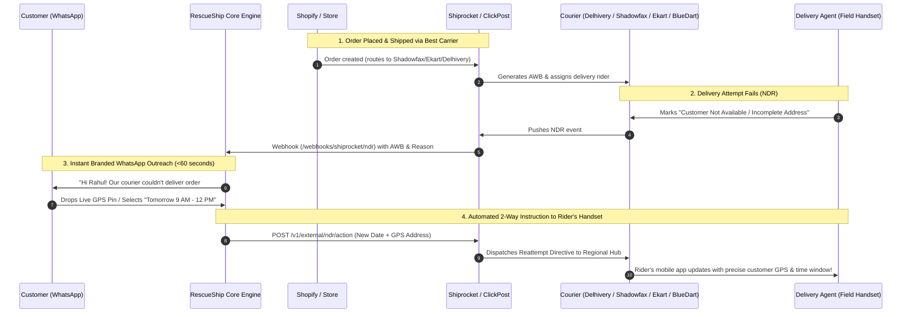

# RescueShip vs. Courier In-House Bots
## Why Independent Logistics Software Outperforms Captive Delivery Tools

---

## 1. Executive Summary

Indian D2C e-commerce is plagued by an **18% to 25% Cash-on-Delivery (COD) Return-to-Origin (RTO)** rate. Recently, courier companies (Shadowfax, Ekart, Delhivery, Shiprocket) have started introducing their own in-house WhatsApp bots and order verification tools.

While couriers market these as "free" or "convenient" add-ons, **they suffer from fundamental architectural flaws, vendor lock-in, and severe commercial conflicts of interest.** 

RescueShip operates as the **independent, carrier-agnostic control layer** that sits directly between the merchant's store (Shopify/WooCommerce) and all shipping partners.

---

## 2. Platform Compatibility & Delivery Agent Communication

### The Real-World Retailer Setup:
> *"A typical store uses Delhivery for North India, Shadowfax for Metros, Ekart for Central India, and BlueDart for high-value orders (routed via Shiprocket)."*

### **Is RescueShip 100% compatible with this exact multi-carrier setup?**
**YES.** Here is the exact technical workflow of how RescueShip tracks, texts, and updates delivery agents across all these carriers:

### How Delivery Agents on the Ground Receive the Update:
1. **Shiprocket Aggregator Layer**: When a merchant connects their Shiprocket account, RescueShip listens to all events across **every underlying carrier** (Delhivery, Shadowfax, Ekart, BlueDart, DTDC, Ecom Express).
2. **Instant Customer Outreach**: The customer receives an interactive WhatsApp template within 60 seconds of the failed attempt.
3. **Automated Carrier API Push**: When the customer chooses *"Reattempt Tomorrow"* or provides an updated building landmark/GPS pin, RescueShip invokes the carrier's NDR action API (`/v1/external/ndr/action` or Delhivery Direct `/api/p/edit`).
4. **Rider App Reflection**: The courier's internal hub routing system updates the manifest for the next morning. The delivery boy’s mobile terminal shows:
   - *Special Customer Instruction: Verified via WhatsApp*
   - *Updated landmark / building details*
   - *Customer-approved reattempt date*

---

## 3. RescueShip vs. Courier Bots: The Complete Breakdown

| Capability / Dimension | Courier In-House Bots (Shadowfax / Ekart / Delhivery) | Aggregator Bot (Shiprocket Engage) | **RescueShip Platform** |
| :--- | :--- | :--- | :--- |
| **Multi-Carrier Independence** | ❌ **Locked to 1 Courier**: Only works when shipping on their own network. Useless for orders on other couriers. | ⚠️ **Locked to Shiprocket**: Only works for orders manifested inside Shiprocket. | ✅ **Universal ("The Switzerland of Logistics")**: Works seamlessly across Shiprocket, Direct Delhivery, ClickPost, and multi-courier setups. |
| **Commercial Alignment** | ❌ **Severe Conflict of Interest**: Couriers bill double freight on RTOs (forward + reverse). They profit when packages return. | ⚠️ Aggregator still earns commissions on reverse freight. | ✅ **100% Merchant-Aligned**: RescueShip only wins when the retailer prevents and rescues RTOs. |
| **"Fake Attempt" Detection** | ❌ **Will Never Audit Themselves**: Delivery boys often fake remarks ("Customer Refused") to meet daily quotas. Courier bots will never admit their riders lied. | ⚠️ Generic dispute tracking with sluggish escalation. | ✅ **Aggressive Fraud Audit Engine**: Discrepancy detection between rider remarks and customer replies. Auto-escalates fake remarks to hub managers. |
| **Branding on WhatsApp** | ❌ **Courier Spam**: Messages arrive from "Shadowfax Logistics" or "Ekart Delivery", confusing shoppers. | ⚠️ Generic aggregator templates. | ✅ **Whitelabel Merchant Identity**: Messages arrive with the merchant's store brand name, driving 2.5x higher response rates. |
| **Deep Shopify Integration** | ❌ **No Store Tagging**: Won't update order tags, customer profiles, or store inventory. | ⚠️ Basic tags with delayed syncing. | ✅ **Real-Time Store Sync**: Automatically tags `COD-Confirmed`, `Fake-Attempt-Flagged`, `Address-Verified`, and syncs fulfillment holds. |
| **COD-to-Prepaid Conversion** | ❌ None (They only do delivery tracking). | ⚠️ Generic payment links. | ✅ **Integrated UPI / Razorpay / Cashfree Engine**: Dynamic QR codes and custom discount incentives (e.g., "Pay ₹50 less via UPI to confirm"). |
| **Live GPS Location Drops** | ❌ Text-only forms requiring manual typing. | ⚠️ Text forms. | ✅ **WhatsApp Native Attachment**: Shopper drops a 1-tap live GPS pin, eliminating vague text directions. |

---

## 4. The 5 Structural Reasons Why Courier Bots Fail Retailers

### 1. The Multi-Carrier Reality
No scaled D2C brand in India relies on a single courier. Shadowfax dominates hyperlocal and metro corridors; Delhivery owns Tier 2/3 coverage; Ekart excels in Flipkart-heavy zones; BlueDart handles high-value air cargo.
- If a brand uses Shadowfax's confirmation bot, **60% of their catalog shipped via Delhivery and BlueDart is left completely exposed.**
- Having 3 different courier bots texting customers from 3 different numbers creates massive customer confusion and spam complaints.
- **RescueShip provides ONE single command center** covering 100% of shipments.

### 2. The Freight Double-Billing Conflict
Every logistics company has a fundamental revenue incentive:
- Successful Delivery = Forward Freight (~₹60).
- RTO Failure = Forward Freight (~₹60) + Reverse Freight (~₹60) = **₹120–₹140 billed to the merchant.**
- Couriers make more freight revenue when an item returns than when it is delivered on the first attempt. Relying on a courier's captive bot to aggressively fight for every delivery is like asking a tax auditor to find deductions that lower their own paycheck.

### 3. The Delivery Boy Quota Problem (Fake Remarks)
Over **40% of first-attempt NDRs in India are fraudulent**:
- Delivery boys running late mark packages as *"Customer Not Available"* or *"Address Incomplete"* while sitting miles away from the delivery address.
- A courier's internal bot will never proactively tell a merchant: *"Our driver lied about visiting your customer."*
- **RescueShip asks the customer directly:** *"Did our delivery agent contact you today?"* When the customer replies *"No, nobody called me!"*, RescueShip flags the shipment with **`isFakeAttempt: true`**, logs a penalty dispute, and prevents immediate return transit.

### 4. Direct Store Financial Automation
Courier bots operate in their own walled gardens. RescueShip integrates into the merchant's financial and store stack:
- Direct **Razorpay & Cashfree UPI integration** to convert high-risk COD orders into non-refundable prepaid orders.
- Native **Shopify webhook automation** that cancels orders, restores inventory, and prevents packing unconfirmed orders.

---

## 5. Sales Battlecards & Objection Handling

### Objection 1: *"Shiprocket and Shadowfax already give me an NDR dashboard. Why should I pay for RescueShip?"*
> **Rebuttal Script:**
> *"Shiprocket and Shadowfax's default bots are generic tools that send messages with their own branding. When a customer sees 'Shiprocket notification', they often ignore it. 
> 
> More importantly, couriers earn double freight on RTO orders, so their bots do not aggressively follow up or catch fake delivery remarks. 
> 
> RescueShip acts as your independent auditor. We message customers with your brand, collect live GPS location pins, audit whether delivery boys actually visited, and sync verified addresses across all your carriers. A single saved order per week pays for the entire platform."*

### Objection 2: *"What if I switch my default courier next month?"*
> **Rebuttal Script:**
> *"That's the beauty of RescueShip. If you move 5,000 orders from Shadowfax to Delhivery or Ekart next month, you don't lose a single customer conversation, metric, or automation rule. RescueShip remains your permanent control layer regardless of which courier carries the box."*

### Objection 3: *"If couriers have OTP-based rejection and will reattempt delivery anyway, why do I need RescueShip? Is RescueShip just a cancel button?"*
> **Rebuttal Script:**
> *"Couriers don't need an OTP to fail your deliveries, and courier reattempts are completely blind. Here is what actually happens:"*

#### 1. The OTP Loophole:
Couriers only mandate an OTP if the delivery boy claims *"Customer explicitly refused the order"*.
What do delivery boys do instead?
They select:
- **"Customer Not Reachable"** (No OTP required)
- **"Address Incomplete / Landmark Missing"** (No OTP required)
- **"Door Locked / Customer Unavailable"** (No OTP required)

The courier system accepts these remarks without asking for any OTP, bypassing the safeguard completely.

#### 2. The "Blind Reattempt" Disaster:
Courier rules say: *"We will attempt delivery 3 times before initiating RTO."*
Here is what happens on Day 2 and Day 3 without RescueShip:
- **Day 1**: Rider tries at 2 PM. Address says *"Flat 204, near Shiv temple"*. Rider can't find the temple or customer is at work. Attempt 1 Fails.
- **Day 2**: The courier hub hands the package back to the rider. **The rider has zero new information.** He still doesn't know where the temple is, and the customer is at work at 2 PM again. Attempt 2 Fails.
- **Day 3**: Rider arrives at the same wrong time with the same bad address. Attempt 3 Fails.
- **Day 4**: **RTO initiated!** The parcel is put on a 7-day return truck back to your warehouse. You are billed ₹140 in two-way courier freight, and your stock was locked for 10 days for nothing.

#### 3. Where RescueShip Breaks the "Blind Reattempt" Cycle:
RescueShip does not exist to be a "Cancel Button". RescueShip exists because couriers reattempt blindly with broken information.

| Failure Scenario | What Courier Default Does (Blind Reattempt) | What RescueShip Does (Resolved Reattempt) |
| :--- | :--- | :--- |
| **Incomplete / Confusing Address** (~38% of RTOs) | Delivery boy fails 3 times looking for the house. Parcel returns to origin. | Customer taps **"Share Location"** on WhatsApp. RescueShip feeds the **exact Google GPS coordinates & building landmark** into the courier system before Attempt #2. Delivered. |
| **Customer Out of Town / At Work** (~30% of RTOs) | Courier blindly tries Thursday & Friday while customer is out of town. Fails 3 times. | Customer taps: **"Deliver on Sunday"**. RescueShip places an **immediate delivery hold on the AWB** until Sunday so attempts are not wasted. Delivered. |
| **No Cash at Home for COD** (~15% of RTOs) | Rider demands cash. Customer has no cash or change. Fails. | RescueShip sends an **instant UPI payment link** on WhatsApp. Customer pays online from office. Rider hands parcel to watchman or neighbor. |
| **Customer Genuinely Doesn't Want It** | Courier wastes 3 attempts and 5 days before starting RTO. | Customer taps **`[Cancel Order]`**. RescueShip immediately stops reattempts on Day 1, saving 5 days of transit delay and returning inventory to shelf. |

---

## 6. Architecture Summary

RescueShip does not compete with couriers on trucks, warehouses, or planes. 
**RescueShip is the intelligence and customer engagement layer that forces couriers to perform.** 

By sitting between Shopify and Shiprocket/Delhivery/ClickPost, RescueShip gives the merchant complete ownership of their customer communication, RTO prevention, and delivery audits.
